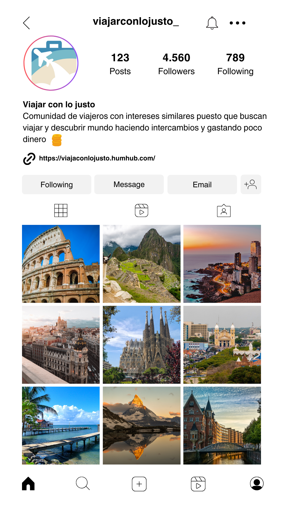

## Viaja Con Lo Justo

(Plantilla para la creación de un proyecto en ideapolis)

Proyecto de Inteligencia Colectiva y Formación en la Empresa 

[Master en Gestión y Tecnologías de Procesos de Negocio](https://masteres.ugr.es/mbagestiontic/)

ETS Ingeniería Informatica y de Telecomunicación Univesidad de Granada  

----

**Titulo** : Viajar con lo justo

**Autor(es)** 
Sebastián Covarrubias
José Almirón
Paola García
Harol Flores

**Resumen** : En esta comunidad, los miembros comparten una pasión por viajar y están dispuestos a abrir las puertas de sus hogares a viajeros de todo el mundo. El intercambio de alojamiento se basa en un principio de reciprocidad: uno ofrece su casa en su país de origen mientras que el otro ofrece la suya en el suyo. 

La clave de este intercambio es el mutuo acuerdo y la afinidad entre los participantes. Antes de concretar el intercambio, ambas partes se conocen a través de la plataforma, intercambian información sobre sus preferencias, intereses y necesidades para asegurarse de que haya una buena conexión y que ambos se sientan cómodos con la idea de hospedarse en el hogar del otro. 

Además del alojamiento, los miembros también pueden intercambiar consejos sobre viajes, recomendaciones de lugares que visitar en cada destino, e incluso pueden coordinar actividades juntos durante su estancia. Se trata de una comunidad en la que se fomenta la amistad, el respeto mutuo y la apertura a nuevas culturas, creando así experiencias de viaje auténticas y enriquecedoras para todos los involucrados.

**logotipo** :  

**Slogan** (frase motivadora/inspiradora): No dejes que nada te detenga, y viaja!

**Hashtag**  #ViajaConLoJusto

**Licencia**    (usar una creative commons: revisar en https://creativecommons.org/licenses/?lang=es_ES) 

**Fecha** : 2024

**Medios** (donde se tiene presencia): 

*  :octocat: https://github.com/SebaNBA/ideapolis 
* HumHub 
* Instagram
* Twitter

----

### ¿Quiénes somos?

Somos un grupo de personas que provenimos de distintos países que nos apasiona viajar y conocer diversas culturas, gastando en lo más mínimo para así preocuparnos solamente de disfrutar la experiencia.

### Misión

Facilitar el acceso a experiencias de viaje únicas al conectar viajeros de todo el mundo para intercambiar alojamiento, conocimientos y experiencias de manera economómica y segura.

#### Vision

Viaja con lo Justo  será la plataforma líder para el intercambio de habitaciones, con una comunidad global activa y comprometida. Aspiramos a ser la opción preferida para viajeros que buscan estancias asequibles y seguras, facilitando conexiones significativas y promoviendo el intercambio cultural sin importar su situación económica. Queremos que nuestro modelo de intercambio sea reconocido por su seguridad, diversidad y contribución a un mundo más consciente y conectado.

----- 

### Metodología

Metodología de desarrollo: Diseño de contenidos digitales mediante estrategia de diseño de Experiencias de usuario (UX experiences) 

### Etapa 1: Ideación de proyecto 

Actividades realizadas mediante Trello https://trello.com/b/3YjvDccp/proyectomultimedia

**¿Como surge el proyecto?**

**Investigación de campo**   Desk research propuestas inspiradoras para el proyecto) 

* @LadyDistopia (link) ...¿ por qué ?
* (...)
* 

## Necesidad/oportunidad:
Debido al aumento del uso de aplicaciones o páginas web de alojamiento como Booking o AirBnb, surge la idea de poder explorar ese mercado pero desde otro punto de vsita, el cual tenga como foco principal el intercambio de hogares, suponiendo así una manera distinta de viajar y disfrutar de las distintas culturas, pero sin perder la seguridad ni la calidad del viaje.

#### Motivación de la propuesta: 

¿ por qué consideras interesante ?

Hemos visto a través de internet que las personas disfrutan en demacía compartir momentos en sus redes sociales, por lo que la propuesta de nosotros de igual modo será compartible y provechosa de divulgar.
Además, también hemos investigado que las plataformas de alojamiento cada vez más suben sus precios y se vuelve un poco inaccesible para la cantdad de personas que quieren disfrutar sus vacaciones sin preocuparse por ejemplo, del dinero.
Creemos que la propuesta es interesante porque además de enfocar su uso para compartir experiencias y enriqueserce de distintas culturas, también será posible hacer amigos, dejar una huella en los lugares que visitan, y por qué no, ahorrar dinero.

#### Personas/Usuarios
(...¿en quién piensas que puede ser útil ? ¿cual es tu publico objetivo?) 
Nuestro público objetivo serán aquellas personas que tengan un hogar al cual recibir viajeros, y por supuesto, que tengan un espirítu aventurero para poder conocer el mayor cantidad de países posibles.

### Etapa 2: Prototipar / productos 

(Productos que has desarrollado y como se plantea la integración de los diferentes medios, pon los que uses) 

Hemos creado una página web y un blog en HumHub. La primera con intención de que las personas conozcan a través de un medio más convencional como lo es una página web, nuestro proyecto y puedan saber más de cómo surgió la idea y qué ofrecemos.
Sin embargo, lo más provechoso que ofrecemos a nuestros usuarios, es la posibilidad de ingresar a nuestra comunidad creada en HumHub para que desde ahí puedan ir investigando qué sitios ofrecen los usuarios y con cuáles de ellos se sienten más identificados, ya sea culturalmente o por intereses.

Nuestra página web está dividia en las siguientes secciones:

## Página de inicio

Explicación Comunidad

Imagenes referencia que suele visitar los usuarios

Redes sociales

Publicidad

Un enlace directo al blog de HumHub

Pequeño apartado sobre nosotros

## Página Destinos

Detalle de algunos destinos con su respectiva descripción, atracciones turísticas recomendadas y vídeos representativos.

## Sobre nosotros

Misión

Visión

Un enlace directo al blog de HumHub

Imagen visual (Portada / Diseño de Interfaz) y herramienta usada

redes sociales.

Tenemos presencia en Twitter e Instagram:

* publicidad: banner (... ) 

* ...

### Etapa 3: Técnicas de evaluación utilizadas

(Estrategia que plantearías para evaluar tu propuesta, medidodes e indicadores de éxito, elige / propone) 

#### Test con usuarios (...) 

Encuestas y cuestionarios: Se pueden diseñar encuestas para recopilar comentarios y opiniones de los usuarios sobre su experiencia en la plataforma. Estas encuestas pueden abordar aspectos como la facilidad de uso del sitio web, la satisfacción con el proceso de intercambio, y la calidad de las conexiones realizadas a través de la comunidad. 

Análisis de datos de uso: Mediante el seguimiento y análisis de datos de uso de la página web, como el número de usuarios registrados, la frecuencia de intercambios realizados, y la duración de las estancias, se pueden obtener indicadores sobre la actividad y la participación de la comunidad. 

Análisis de retroalimentación: Analizar las opiniones, comentarios y sugerencias proporcionadas por los usuarios a través de diferentes canales de comunicación, como correos electrónicos, mensajes en el sitio web o redes sociales, para identificar patrones y tendencias en la retroalimentación recibida. 

#### Preguntas frecuentes

¿Cómo funciona el proceso de intercambio de hospedaje en la plataforma? 

¿Cuáles son los requisitos para unirse a la comunidad de intercambio de hospedaje? 

¿Es seguro intercambiar hospedaje a través de la plataforma? 

¿Cómo puedo encontrar a personas interesadas en intercambiar hospedaje en mi destino deseado? 

¿Qué tipo de alojamiento se ofrece en la plataforma? ¿Hay opciones como casas, apartamentos, habitaciones privadas, etc.? 

¿Se puede cancelar un intercambio de hospedaje? 

¿Hay algún costo asociado con el uso de la plataforma? 

¿Cómo puedo garantizar que haya una buena conexión con la persona con la que intercambiaré hospedaje? 

¿Qué debo hacer si surge algún problema durante mi estancia en el alojamiento de intercambio? 

¿Puedo dejar reseñas y calificaciones sobre mis experiencias de intercambio de hospedaje en la plataforma? 

### Conclusiones y trabajo futuro

* Grado de consecución del proyecto 
* Problemas identificados  (técnicos / sobre la idea inicial / planificacion… ) 
* Propuestas de mejora (por qué consideras que merece la pena continuar)
* Posible interés del proyecto (¿ Quien podría  colaborar / involucrarse en el proyecto? ¿viable?)

Referencias y recursos: 

* Artículos ..  
* Productos utilizados  
* Propuestas de mejora

(...)

----

**Referencias y recursos utilizados** :

* [Proceso UX](https://uxmastery.com/resources/process/)
* [Diseño de Experiencias UX](http://www.nosolousabilidad.com/articulos/uxd.htm) 
* [Métodos UX](https://mgea.github.io/UX-DIU-Checklist/index.html) 
* [MuseMap: ejemplo de experiencia UX](https://blog.prototypr.io/musemap-street-art-app-ux-case-study-9bec6a99823b) 
* (...) 

(...)
* (Artículos ..  )
* (Productos utilizados ) 
* (Recursos tipo Imágenes, videos , etc.) 

